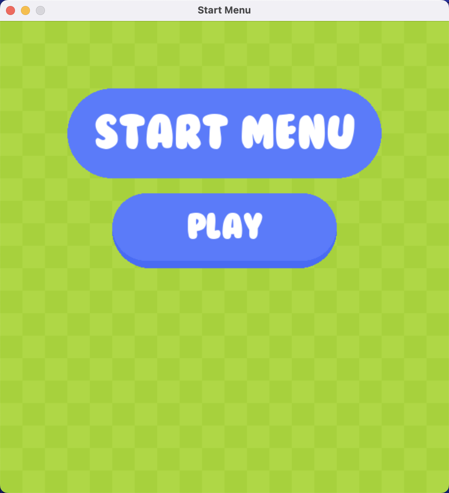
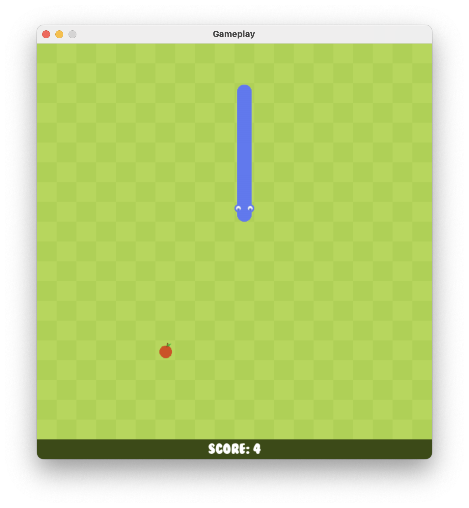
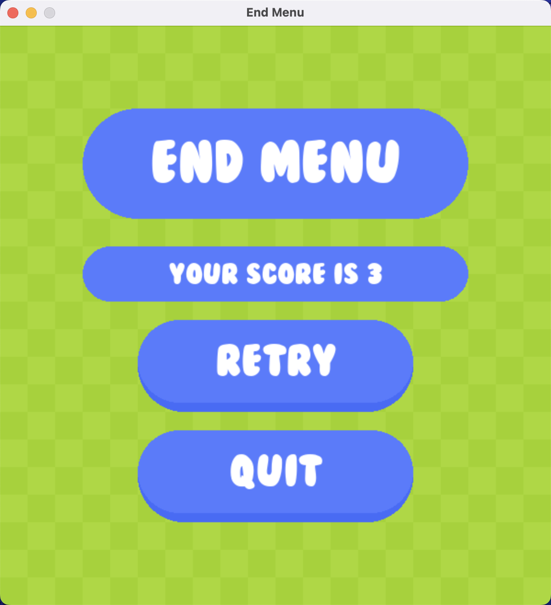

# Snake-Game-GUI-Python


<p>
  Snake game in Python using the pygame module.<br>
  Later on, a settings menu might be added, where a player could change the screensize or the difficulty of the game.<br>
  Credits for the images and the sound: <a href="https://github.com/clear-code-projects/Snake" target="_blank">here</a>
</p>

## Packages To Install:

```
pip install pygame
```

## Running the Snake:

```
git clone https://github.com/berkaykush/Snake-Game-GUI-Python.git
cd Sanke-Game-GUI-Python
python code/main.py
```
or 
```
git clone https://github.com/berkaykush/Snake-Game-GUI-Python.git
cd Sanke-Game-GUI-Python/code
python main.py
```
https://user-images.githubusercontent.com/70837975/209442647-7504e87c-d74b-4c5b-9b57-ab49b22c2db3.mp4

## Screenshots
<p>


  
  
</p>

## Author
Berkay Kush
